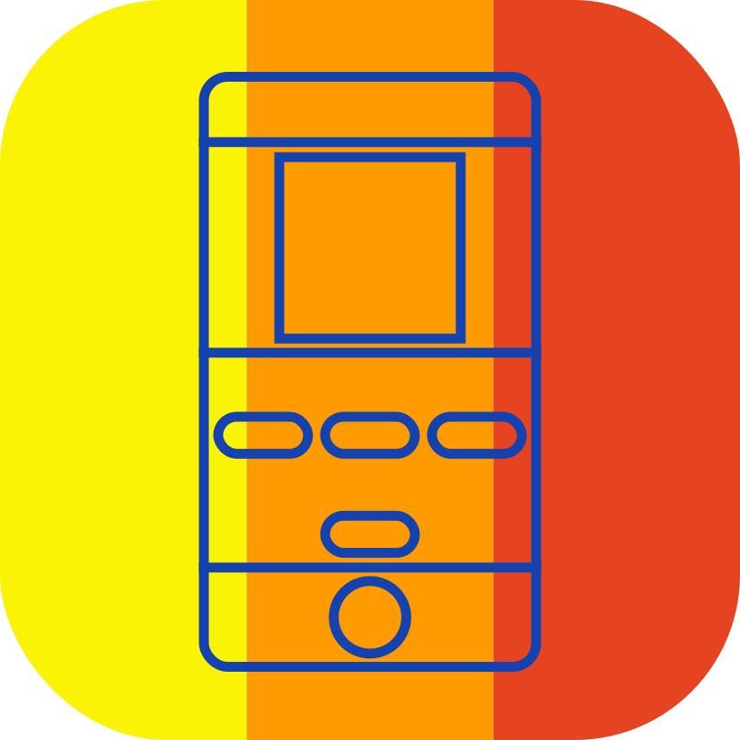

    
    

# Milton

An emulator for the Microvision (aka Milton Bradley Microvision), written in rust 🦀!

This emulator aims to serve as a fully accurate reference for the Microvision system so that more work might be done around this simplistic short-lived console in the future.